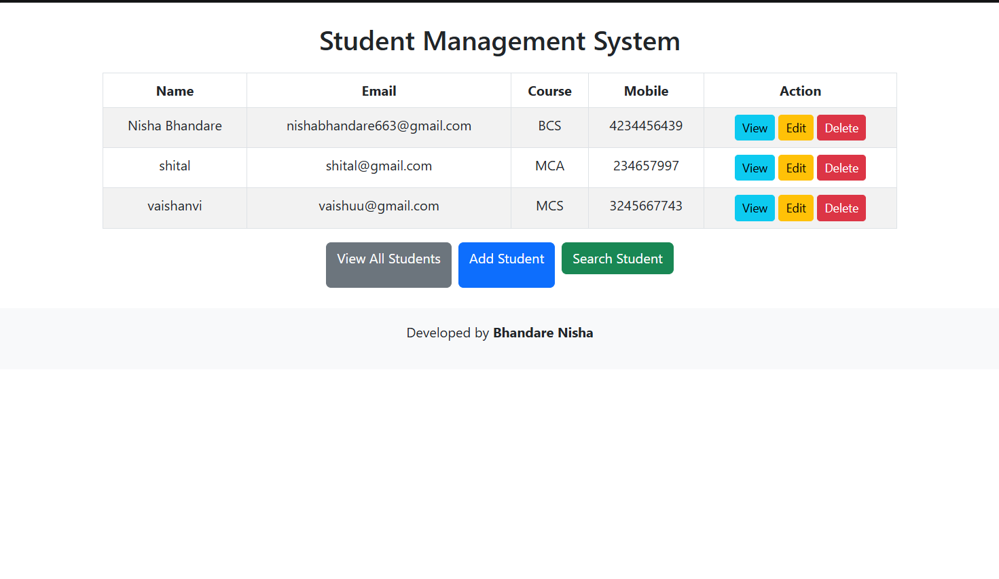
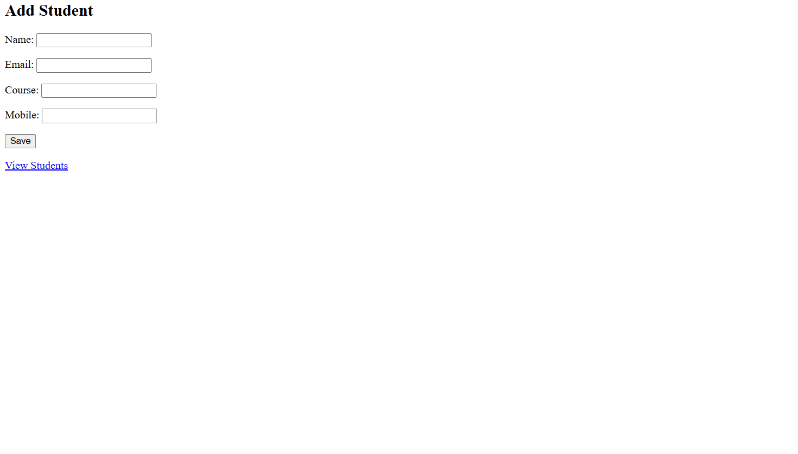
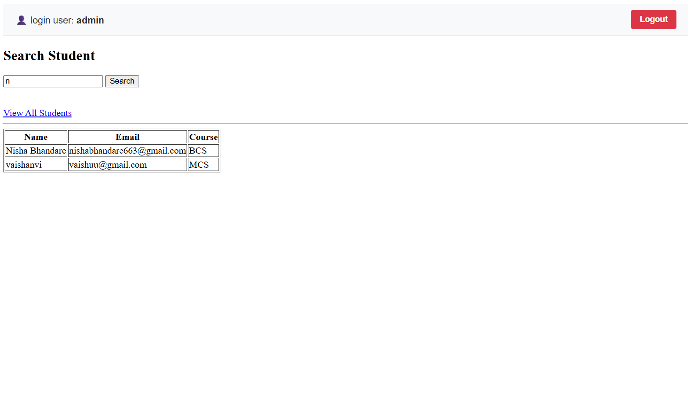

# 🎓 Student Management System (Django)

A simple Student Management System built using Django.  
It allows basic student record management with authentication.

---

## 🚀 Features

- Login / Logout system  
- Add student  
- View student list  
- Update student details  
- Delete student  
- Admin panel support  

---

## 🛠️ Tech Stack

- Python  
- Django  
- SQLite  
- HTML, CSS  

---

## 📁 Project Structure

```
Student_Management_System/
├── Students/
├── Student_Management_System/
├── db.sqlite3
├── manage.py
```

## ⚙️ Setup Instructions

### 1. Clone repo

git clone https://github.com/nishabhandare/Student-Management-System.git
cd Student-Management-System


### 2. Create virtual environment

python -m venv venv
venv\Scripts\activate


### 3. Install Django

pip install django


### 4. Run migrations

python manage.py makemigrations
python manage.py migrate


### 5. Create superuser

python manage.py createsuperuser


### 6. Run server

python manage.py runserver


### 7. Open browser

http://127.0.0.1:8000/


### All Students List Page


### Add Student Page


### Login / Search Page


### Dashboard



👨‍💻 Author

Nisha Bhandare


⭐ Project Status

Completed ✔️


---
